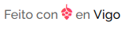

# Vigotech _made with love_ widget #

Ferramenta para engadir de forma sinxela a ligazón "Feito con (amor) en Vigo" empregando a icona da _piña_

 
# Uso #
 
 Engadir unha ligazon da seguinte forma
 
 <a
   class="vigotech-made-with"
   href="https://vigotech.org"
   data-theme="light"
   data-lang="gl"
>
 Made width love in Vigo
</a>

* A clase _vigotech-made-with_ é requerida
* O _href_ será sobreescrito o igual que o contido da ligazón
* _data-theme_ esquema de cores. Os valores posibles son:
  * **light** _(valor por defecto)_
  * **dark**: Para empregar o widget sobre fondos escuros
* _data-lang_ linguaxe do contido da ligazón _(por defecto gl)_. Os valores posibles son:
  * **es**: Castelán
  * **en**: Inglés
  * **gl**: Galego
 
 
Engadir o script

  
  
Sempre o final do _body_ (despois das ligazóns)

 